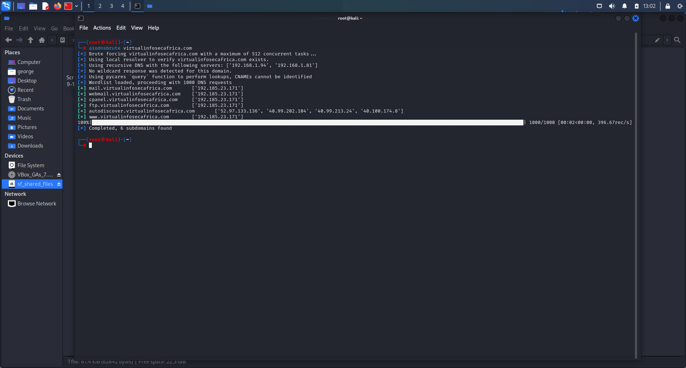
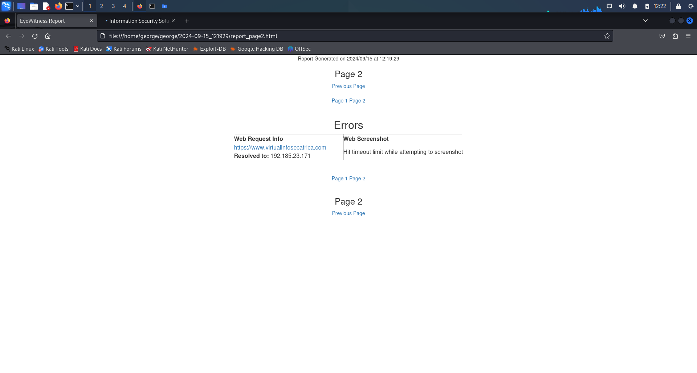
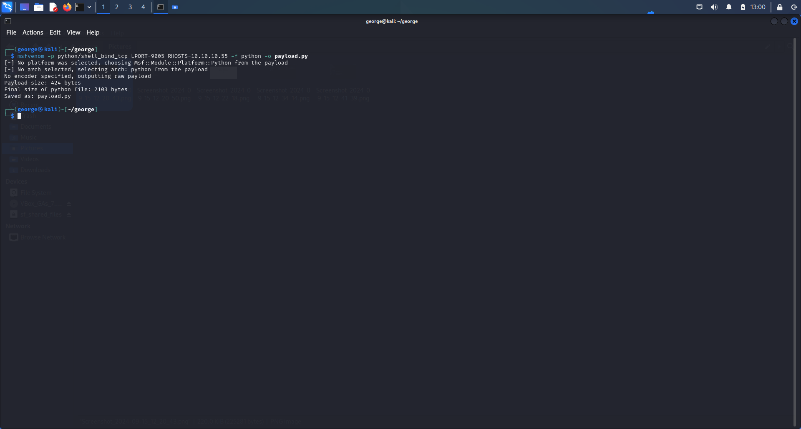

# INTERNAL NETWORK PENETRATION TEST

## For: VIRTUAL INFOSEC AFRICA

 

 ## COMPANY NAME: VIRTUAL INFOSEC AFRICA

 ### Submitted by: Student of Virtual Infosec Africa
 [Virtual Infosec Africa](https://virtualinfosecafrica.com)

.

# Table of Contents

### Internal Network Penetration Testing Guidelines
  * Scope

### Testing Methodology
* **Host Discovery**
* **Service Discovery and Port Scanning**

### Summary of Findings
* **Vulnerability Scanning**
* **Web-Based Attack Surfaces**
* **Generating Payloads**

# Internal Network Penetration Testing Guidelines

Internal network penetration testing involves evaluating the security of an organization's internal IT infrastructure. It's aim is to discover vulnerabilities within a trusted network, simulating what an attacker or a compromised system might exploit. Below are key guidelines to follow during an internal network penetration test:

###  Reconnaissance: (Information Gathering)
 1. **Active Reconnaissance**: This involves the use of scanning tools (eg. Nmap, ping, zenmap, arp-scan) to discover hosts, open ports and service running within the network. NB (We can also perform DNS bruteforcing using aiodnsbrute)
 2.  **Passive Reconnaissance**: This is where we analyze internal documentation, logs, and user directories for internal architecture insights. Packet sniffing is a method used in passive reconnaissance and the tool, wireshark is used for this activity.
   

### Vulnerability Scanning
Vulnerabilty scanning is the process used to identify and assess potential security weaknesses, flaws, or vulnerabilities in a computer system, network, or application. This process helps organizations detect vulnerabilities before they are exploited by attackers, allowing them to take preventive measures.

## Classification  of Vulnerability Scanning Based on Scope

1. **Network-Based Scanning**: 
    * Scans an organization's network infrastructure to find vulnerabilities in devices like routers, firewalls, switches and servers.
    * Detects weaknesses such as open ports, unpatched services, and insecure network configurations.

2. **Host-Based Scanning**:
    * Focusses on individual computers or servers.
    * It inspects th operating systems, and local configurations to identify vulnerabilities like unpatched software, improper configurations, or malware.
3. **Application-Based Scanning**:
    * Scans web applications or software vulnerabilities.
    * Identifies issues such as SQL injection, cross-site scripting(XSS), insecure authentication mechanisms, and more.
4. **Database Scanning**:
    * Targets vulnerabilities within database management systems(DBMS).
    * Scans for weak configurations, default accounts, unpatched software, and SQL injection vulnerabilities.
5. **Cloud-BAsed Scanning**:
    * Specifically designed for cloud environments.
    * Scans cloud assets, configurations, storage buckets, and virtual machines for potential security risks.

6. **IoT Scanning**:
    * Focusses on the Internet of Things(IoT) devices, which may have weak default credentials or outdated firmware.
    * Scans for misconfigurations, insecure protocols, and firmware vulnerabilities.

The **NIST Common Vulnerability Scoring System (CVSS)** is a standardized framework used in vulnerability scanning to assess the severity of security vulnerabilities .Developed by the National Institute of Standard and Technology(NIST) and maintained as part of the National Vulnerability Database(NVD), CVSS provides a numerical score (typically from 0 to 10) to help security professionals proritize remediation efforts based on the risk posed by a vulnerability.

Visit [MITRE Corporation CVE list](https://cve.mitre.org) for more information

## Scope

The scope of engagement comprises of the internal network: **10.10.10.0/24** and a domain name: https://virtualinfosecafrica.com/ 

# TESTING METHODOLOGY

## 1. Host Discovery

* With the use of a tool like Nmap, we're able to describe what it means to do a host discovery and included screenshots of the commands we would use with nmap to perform a host discovery with explanations on the options we choose for the command.

Assuming 15 hosts are up, we can filter our output by using commands such us **grep**, **awk** and **cat** and can save them into a file using the **greater than (>)** command

Eg:
> **nmap -sn 10.10.10.0/24** | grep -i "Nmap scan report for" | awk ('print $5') >**Host_dicovery.txt** 

We can demonstrate a subdomain enumeration using a tool like **aiodnsbrute** with the domain provided in the scope.

# Service Discovery and Port Scanning

Service discovery and port scanning are essential steps in network security, administration, and troubleshooting. It is necessary because:

1. ### It Identifies Active Services and Open Ports

    * **Service discovery** helps in identifying what services are running on a network, such as web servers (HTTP/HTTPS), mail servers (SMTP), file transfer (FTP), and so on.
    * **Port scanning** is used to determine which ports are open and listening for incoming connections on a host. Since each service runs on specific ports (eg., HTTP on port 80), scanning reveals which services are active by checking the state of these ports.

2. ### Security Auditing and Vulnerability Assessment
3. ### Troubleshooting Network Issues
4. ### Network Inventory and Documentation
5. ### Detect Unauthorized Services or Malware

Basically, service dicovery and port scanning are necessary for understanding the structure and health of a network, preventing vulnerabilities, enhancing security, and ensuring efficient network operation.

Using Nmap to perform a service discovery.

> **nmap -sV 10.10.10.0/24 -oG service_discovery.gnmap**

 Taking note of the service versions, we can use resources like Expolitdb and [MITRE CVE](cve.mitre.org) to identify relevant vulnerabilities associated with the services indicated. 

 # Summary Findings

| Name| Score |
| --- | --- | 
| Apache httpd 2.4.49 (CVE-2021-41773) | High |
| MySql 5.6.49 (CVE-2021-26887) | High |
| RealVNC 5.3.2 (CVE-2024-5775)   | High |
| UltraVNC 1.2.1.7 (CVE-2022-25246)|     Critical |
| BSD telnetd (CVE-2001-0554)                      |  Critical|
| Microsoft Terminal Service(CVE-2021-26887)| High |

## Detailed Findings

### Path Traversal and Remote Code Execution(RCE) vulnerability (Apache httpd 2.4.49 vulnerability)

A flaw was found in a change made to path normalization in Apache HTTP Server 2.4.49. An attacker could use a path traversal attack to map URLs to files outside the directories configured by Alias-like directives. If files outside of these directories are not protected by the usual default configuration "require all denied", these requests can succeed. If CGI scripts are also enabled for these aliased pathes, this could allow for remote code execution. This issue is known to be exploited in the wild. This issue only affects Apache 2.4.49 and not earlier versions. The fix in Apache HTTP Server 2.4.50 was found to be incomplete.

**Evidence**:

**Affected Resources:**

**10.10.10.2, 10.10.10.30, 10.10.10.45, 10.10.10.55**

**Recommendations:**
1. **Immediate upgrade**:

 upgrade to at least **Apache HTTP Server 2.4.51 or higher.** Versions 2.4.49 and 2.4.50 are vulnerable to CVE-2021-41773 and other related issues
2. **Apply Security patches:**

If upgrading is not immediately possible, apply security patches available for 2.4.49. However, this should only be a temporal solution and upgrading is highly recommended.

3. **Restrict access to sensitive files:**

Use proper access control.

Ensure that AllowOverride directive is properly configured to prevent unauthorized users from altering .htaccess files.

4. **Regular Security Audits**:

Perform routine security audits and scans on your web server using tools like **Nessus, OpenVAS**, or **Qualys** to ensure no other vulnerabilities exist.

**References**:

https://cwe.mitre.org/data/definitions/521.html

 ### Privilage escalation, improper input handling and denial of service(DoS) attacks:

 

 MySQL 5.6.49 is an older version that contains several known vulnerabilities, some of which can be critical depending on your use case. One prominent vulnerability in this version is related to privilage escalation, improper input handling and denial of service(DoS) attacks.

 ## Evidence:
Using my protocol specific file I created under service discovery, I was able to scan for vulnerabilities with the *Metasploit Auxilliary Module*

steps:
> 1. msfconsole
>
> 2. search and use mysql_login
>
> 3. info
>
> 4. set USER_FILE userlist.txt
>
> 5. set PASS_FILE passlist.txt
>
>6. set RHOSTS 10.10.10.0/24
>
> 7. **run**

 **Affected Resources:**

 **10.10.10.5, 10.10.10.40**

 **Recommendations:**

 1. **Upgrade to a Supported Version:**

 * MySQL 5.6 ha reached end-of-life (EOL) as of **Febuary 2021.** Oracle no longer provides updates, including security patches. It is highly recommended to upgrade to a supported version like **MySQL 8.x** to ensure ongoing security fixes and enhancements.

* If you prefer using a compatible version, consider upgrading to **MariaDB 10.x**, which is a fork of MySQL and actively maintained.

2. **Harden MySQL Configuration:**

* Disable unnecessary user accounts and limit user privilages to the minimum necessary. Avoid granting unnecessary permissions, especially to the root or superuser.

* Set proper **authentication methods** and ensure that strong passwords are enforced for all accounts.

* Use **SSL/TLS encryption** for client-server communiations to prevent eavesdropping.

* Set appropriate **firewall rules** to allow access only from trusted IPs and block any unnecessary external access to MySQL ports (3306 by default).

## Authentication bypass, Buffer overflow, and Remote code execution (RCE).

**RealVNC 5.3.2** ia an older version of RealVNC, a popular remote access and control software that allows users to connect and control a computer from a remote location. It supports various platforms, including Windows, macOS, and Linux. RealVNC 5.3.2 is known to have several vulnerabilities, including issues related to authentication bypass, buffer overflow, and remote code execution (RCE).
**UltraVNC 1.2.1.7** has a known vulnerability which is related to a heap buffer overflow that could allow remote attackers to execute arbitrary code. This issue occurs when UltraVNC improperly processes incoming data, leading to potential system compromise.

## Evidence:

**Affected resources:**

10.10.10.10 and 10.10.10.50

**Recommendations:**

1. Restrict Access
2. Disable unused features
3. Upgrade to latest version
4. Enable encryption

## BSD telnetd (Telnet Daemon)
It has a lot of vulnerabilities due to lack of encryption and outdated security practices. Telnet itself, including the BSD implemantation, is widely considered insecure and has been largely replaced by **SSH**(Secure Shell) for secure remote login. CVE-2001-0554 (Buffer Overflow) in telnetd is a vulnerability in the BSD telnetd code that can be triggered when the daemon processes a large number of arguments. An attacker can exploit this vulnerabiliy to crash the telnet service or potentially execute arbitrary code, leading to full system compromise. By sendind a specifically crafted request, an attacker can exploit the buffer overflow.

**Evidence:**

**Affected Resources**:

10.10.10.20

**Recommendation:**
Apply patches from the BSD project or disable telnetd to avoid exploitation.

Assuming I had to develop my own custom wordlist, I can use the tool called **Cewl**.

syntax used:
> cewl -m5 -w passlist.txt -cv -o virtualinfosecafrica.com

# Web-Based Attack Surfaces

Eyewitness is a tool used to take screenshots of web applications, open RDP services, and open VNC servers, which helps in identifying and reporting vulnerabilities. It is especially helpful when performing reconnaissance and vulnerability assessments. Below is an example of the syntax for using EyeWitness:

> eyewitness --timeout 15 -f sites.txt

## Generating Payloads

I was able to generate payloads using a tool called **msfvenom**

To generate a payload that can trigger a **TCP bind shell** with **msfvenom**, assuming the host is 10.10.10.55 and runs on an Apache Tomcat web server(Java based), we use the **syntax command**:

> msfvenom -p java/shell/bind_tcp LPORT=9005 RHOSTS=10.10.10.55 -f war -o payload.war

To generate a payload that can execute **base64** with **msfvenom**, assuming the host is 10.10.10.55 and runs a Python server, we use the **syntax command**:

> msfvenom -p python/shell_bind_tcp  LPORT=9005 RHOSTS=10.10.10.55 -f python -o payload.py

    
  
  

 